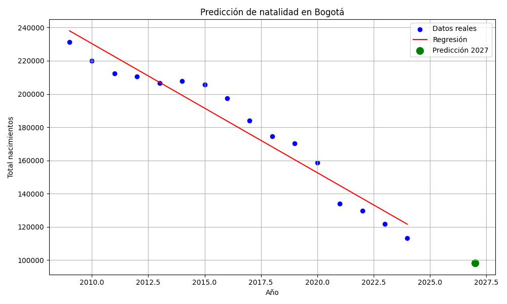

# natalidad_app
Sistema que permite predecir la cantidad de nacimientos en Bogotá usando datos reales del DANE y un modelo de regresión lineal.
# Predicción de Natalidad en Bogotá con Flask y Machine Learning

Este proyecto tiene como objetivo predecir el número de nacimientos en Bogotá para un año ingresado por el usuario, utilizando un modelo de **regresión lineal** entrenado con datos reales del DANE.

## Descripción

- Se utiliza un archivo CSV con datos históricos de nacimientos por año en Bogotá.
- El modelo de Machine Learning (Regresión Lineal) se entrena usando `scikit-learn`.
- Se construyó una aplicación web en Flask que permite al usuario ingresar un año y visualizar la predicción junto con una gráfica generada por `matplotlib`.

## Tecnologías usadas

- Python 3
- Flask
- Pandas
- Scikit-learn
- Matplotlib
- HTML + Jinja2
- CSS

## Captura de pantalla



## Cómo ejecutar

1. Clona el repositorio:

```bash
git clone https://github.com/tu_usuario/natalidad_app.git
cd natalidad_app

